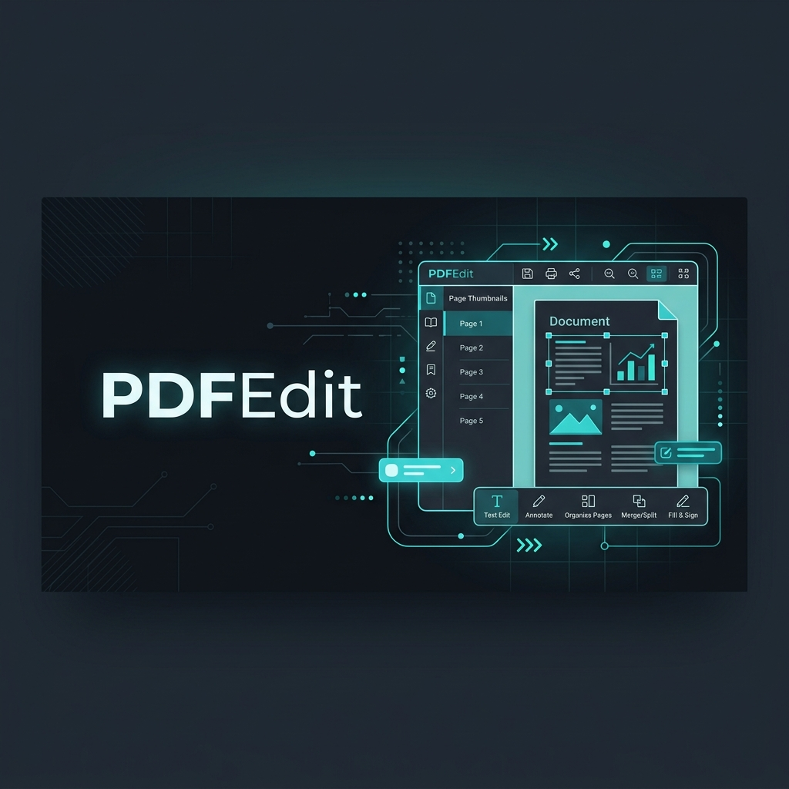
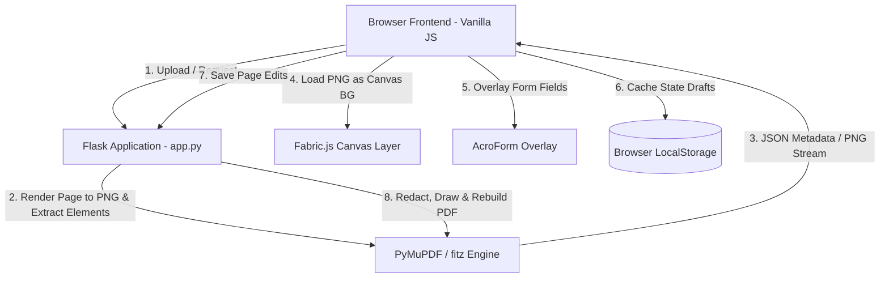

<p align="center">
  
</p>

<h1 align="center">PDFEdit</h1>

<p align="center">
  <strong>A premium, full-featured web-based PDF editor built with Flask, PyMuPDF, and Fabric.js.</strong>
</p>

<p align="center">
  
  
  
  
  
</p>

---

## Overview

**PDFEdit** is a powerful, self-hosted, web-based PDF editing platform. It brings the complexity of desktop PDF annotation software directly to the browser. By combining a robust Python/Flask backend powered by **PyMuPDF** with a dynamic, high-performance **Fabric.js** canvas frontend, PDFEdit provides seamless document viewing, annotation, form-filling, redact-on-save operations, OCR capabilities, and structured table detection.

---

## Key Features

### Advanced Document Lifecycle
*   **Zero-Install Uploads:** Drag-and-drop PDFs (up to 50MB) directly into the upload area or editor overlay. Fast, secure processing.
*   **Encrypted PDFs:** Full AES-256 password decryption support with secure browser-side password prompt modal.
*   **Dynamic New Documents:** Create clean blank PDFs from scratch with standard presets (`A4`, `Letter`, `Legal`, `A3`, `A5`) or custom point dimensions.
*   **Intelligent Local Sync:** Keep work safe with server-side page state commits, automatic thumbnail rendering, and session connection restore from `localStorage` drafts after browser reloads.
*   **Loss-Free Export:** Download fully assembled PDFs with robust layout integrity, form flattening options, page splits, and multi-level encryption passwords.

### Precise Annotations & Visual Edits
*   **Interactive Editing:** Move, scale, rotate, and delete existing PDF-origin text, shapes, drawings, and images. Deletions are securely flattened as true PDF redactions upon saving.
*   **Multi-font Textboxes:** Insert customizable text nodes with control over typography, sizes, colors, transparency, alignments, background styling, and rotation.
*   **Dynamic Image Overlay:** Import `PNG`, `JPEG`, `SVG`, or `WebP` graphics. Keep original ratios with aspect-lock scaling, rotation, transparency, and customizable Z-ordering.
*   **Custom Shapes & Freehand Sketching:** Add rectangle, ellipse, line, arrow, and star paths. Freehand sketching offers smooth pressure-like lines, dashed/dotted stroke styles, and custom opacity.
*   **Smart Annotation Types:** Add semi-transparent text highlights, colored sticky notes with floating popup markdown-like editors, stamp overlays (e.g., `APPROVED`, `DRAFT`, `CONFIDENTIAL`, `VOID`), and secure true PDF redacting layers.
*   **Professional Signature & Initials Pad:** Draw, type using elegant cursive script generators, or upload your signature. Manage your personal signature drawer with persistent gallery profiles.
*   **Local History Engine:** Robust per-page multi-step action recovery supporting up to 50 levels of Undo/Redo (`Ctrl+Z` / `Ctrl+Y`).

### Smart Form Fields & Interactivity
*   **Form Filler:** Interactive filling for standard AcroForms including Text inputs, Checkboxes, Radio buttons, Comboboxes (dropdowns), and multi-select Listboxes.
*   **Interactive Form Builder:** Design custom form inputs dynamically in visual "Form Mode" with precise sizing, aligning, and positioning.
*   **Field Management:** Complete overview of all document form elements in a collapsible sidebar with jump-to-field quick links.
*   **Hyperlink Manager:** Highlight strings of text or draw precise bounding regions to bind external URIs (web, mail, phone presets) or in-document page targets.

### Deep Page Operations
*   **Lazy-Loaded Navigation:** Browse heavy documents easily using custom lazy-loading thumbnails, direct page jump input, and responsive sidebar navigation.
*   **Visual Page Reordering:** Drag-and-drop thumbnails to seamlessly re-sequence pages in real-time.
*   **Advanced Page Controls:** Append blank pages, duplicate existing configurations, rotate pages (90°/180°/270°), or purge pages safely (prevents absolute empty documents).
*   **Per-Page Analytics:** Export standalone high-DPI single pages, extract pristine plain text, execute layout OCR, or run precise AI table structure detection.

### Intelligent OCR & Table Extraction
*   **Server-Side OCR:** Run layout analysis on scanned images or raw PDFs to superimpose editable canvas text blocks (requires *Tesseract OCR* server package).
*   **Automatic Table Parser:** Scan page coordinates for structured borders and tabular grids. View real-time overlays and export parsed tables directly as ready-to-use CSV logs.

---

## Hotkeys & Keyboard Shortcuts

Enhance your productivity with rich, desktop-grade keyboard layouts:

| Shortcut | Action | Category |
|:---|:---|:---|
| <kbd>Ctrl</kbd> + <kbd>O</kbd> / <kbd>Cmd</kbd> + <kbd>O</kbd> | Open New PDF File | Lifecycle |
| <kbd>Ctrl</kbd> + <kbd>S</kbd> / <kbd>Cmd</kbd> + <kbd>S</kbd> | Save Current Page State | Lifecycle |
| <kbd>Ctrl</kbd> + <kbd>Z</kbd> / <kbd>Cmd</kbd> + <kbd>Z</kbd> | Undo Last Action | Editor |
| <kbd>Ctrl</kbd> + <kbd>Y</kbd> / <kbd>Cmd</kbd> + <kbd>Y</kbd> | Redo Undone Action | Editor |
| <kbd>V</kbd> | Select Tool | Mode |
| <kbd>O</kbd> | Form Elements Editor Mode | Mode |
| <kbd>T</kbd> | Add Text Box | Annotations |
| <kbd>I</kbd> | Insert Image Node | Annotations |
| <kbd>R</kbd> | Draw Rectangle | Shapes |
| <kbd>E</kbd> | Draw Ellipse | Shapes |
| <kbd>L</kbd> | Draw Straight Line | Shapes |
| <kbd>F</kbd> | Freehand Pen / Sketching | Annotations |
| <kbd>H</kbd> | Highlight Bounding Area | Annotations |
| <kbd>N</kbd> | Sticky Note Annotation | Annotations |
| <kbd>X</kbd> | Create Redaction Block | Annotations |
| <kbd>P</kbd> | Place Visual Stamp | Annotations |
| <kbd>K</kbd> | Apply Hyperlink Area | Annotations |
| <kbd>Delete</kbd> / <kbd>Backspace</kbd> | Remove Active Selection | Editor |
| <kbd>+</kbd> / <kbd>=</kbd> | Zoom In (+10%) | Canvas |
| <kbd>-</kbd> | Zoom Out (-10%) | Canvas |
| <kbd>Esc</kbd> | Cancel / Exit Active Tool (Switch to Select) | Canvas |
| <kbd>▲</kbd> / <kbd>▼</kbd> / <kbd>◀</kbd> / <kbd>▶</kbd> | Nudge Active Object (1px) | Positioning |
| <kbd>Shift</kbd> + <kbd>Arrows</kbd> | High-speed Nudge Object (10px) | Positioning |

> [!NOTE]
> Additional toolbar features, including the signature tool (<kbd>S</kbd>), shapes expansion dropdown (<kbd>U</kbd>), and dynamic eraser tool (<kbd>Del</kbd>), have shortcut indicators styled in their tooltip cards for quick user reference.

---

## Technical Architecture & Design

PDFEdit is engineered as a lightweight, zero-latency hybrid application decoupling complex document rendering from interactive UI state.



### Key Engineering Details:
1.  **Dual Layer Rendering:** The PDF background is rendered as a clean high-resolution PNG on the fly by **PyMuPDF**, while dynamic user-created annotations live on an interactive HTML5 canvas powered by **Fabric.js**.
2.  **Native PDF Modification:** Rather than simply pasting visual layers over PDFs, modified or deleted original elements trigger server-side bounding box redactions. On save, PyMuPDF deletes the original binary element and burns the newly adjusted element natively into the PDF's structure.
3.  **Draft Caching:** When edits are made, state-deltas are immediately backed up in `localStorage`. If a crash or refresh occurs, the client seamlessly reconciles server-side state with the local transaction drafts.
4.  **Decoupled Form Processing:** AcroForm fields are parsed by PyMuPDF and projected as an interactive HTML form overlay exactly matching page aspect scale. Editing values works natively, and on saving, the server writes form state back into the PDF catalog dictionaries.

---

## Project Structure

```
PDFEdit/
├── app.py                # Flask server & PDF structural engines
├── requirements.txt      # Python package requirements
├── assets/
│   └── banner.png        # Brand mockup banner image
├── static/
│   ├── api.js            # Unified asynchronous API controller
│   ├── app.js            # Global UI bindings, state managers & shortcuts
│   ├── editor.js         # Canvas rendering layer (Fabric.js engine)
│   ├── forms.js          # Interactive AcroForm rendering overlays
│   ├── signature.js      # Signature / Initials canvas pad & profiles drawer
│   ├── toolbar.js        # Dynamic property controllers & tools dropdowns
│   └── style.css         # UI design system tokens (light / dark modes)
├── templates/
│   └── index.html        # Single Page Application core frame
├── sessions_db.json      # Dynamic session metadata logs
├── .gitignore            # Git exclusion rules
└── README.md             # Product documentation
```

---

## Installation & Getting Started

Follow these steps to run PDFEdit on your local machine.

### Prerequisites

*   **Python 3.8+**
*   **Tesseract OCR** (Optional, required for OCR-to-text layer conversions)
    *   *Debian/Ubuntu:* `sudo apt-get install tesseract-ocr tesseract-ocr-eng`
    *   *macOS (Homebrew):* `brew install tesseract`
    *   *Windows:* Download and run installer from [UB Mannheim](https://github.com/UB-Mannheim/tesseract/wiki), then add `tesseract.exe` path to system environment variables.

---

### Step-by-Step Installation

#### 1. Clone the Repository
```bash
git clone https://github.com/ClaudiuJitea/PDFEdit.git
cd PDFEdit
```

#### 2. Environment Setup
Choose either **Conda** or **Standard Python venv** to sandbox the dependencies:

##### Option A: Using Conda (Recommended)
```bash
# Create a fresh sandboxed environment
conda create -n pdfedit python=3.11 -y

# Activate the environment
conda activate pdfedit
```

##### Option B: Using Python Virtual Environment (`venv`)
```bash
# Create a virtual environment
python -m venv venv

# Activate on Linux/macOS:
source venv/bin/activate

# Activate on Windows (cmd):
venv\Scripts\activate.bat

# Activate on Windows (PowerShell):
.\venv\Scripts\Activate.ps1
```

#### 3. Install Python Dependencies
With your sandboxed environment active, install the package ecosystem:
```bash
pip install --upgrade pip
pip install -r requirements.txt
```

---

### Running the Server

Launch the web service in development mode:
```bash
python app.py
```

*   **Host URL:** By default, the application runs on [http://127.0.0.1:5001](http://127.0.0.1:5001)
*   **Custom Host/Port:** To change coordinates, customize the arguments in `app.py` or export environment variables:
    ```bash
    export FLASK_RUN_PORT=8080
    python app.py
    ```

---

## Technology Stack

PDFEdit relies on a highly focused, modern open-source toolchain:

*   **Core Backend Engine:** [Python 3](https://www.python.org/) & [Flask](https://flask.palletsprojects.com/) (REST routing, session state context).
*   **PDF Binary Engine:** [PyMuPDF (fitz)](https://pymupdf.readthedocs.io/) (High-speed document parsing, native AcroForm injection, precise redaction).
*   **Image Parsing:** [Pillow (PIL)](https://python-pillow.org/) (High-performance pixel processing).
*   **Interactive UI Layer:** [Fabric.js v5](https://fabricjs.com/) (HTML5 Canvas vector engine, object collision, scaling, custom canvas serialize/deserialize).
*   **Typography:** Google Fonts integration (Inter, Outfit, Fira Code).

---

## API Reference

The PDFEdit server exposes a comprehensive, RESTful JSON API for PDF extraction, conversion, manipulation, and metadata management.

### Base URL: `http://127.0.0.1:5001/api`

<details>
<summary>1. Document & Session Lifecycle</summary>

| Endpoint | Method | Description | Payload / Parameters |
|:---|:---|:---|:---|
| `/upload` | `POST` | Upload a PDF document and initialize a server-side session | Multipart: `file`, optional `password` |
| `/new` | `POST` | Initialize a new empty PDF page canvas | JSON: `preset` (`A4`/`Letter`/etc.) or `width`/`height` in points |
| `/session/<session>` | `GET` | Fetch session metadata, page count, sizes, bookmarks, and structural outline | None |
| `/session/<session>` | `DELETE` | Terminate session and completely delete temporary cache files from disk | None |
| `/session/<session>/merge` | `POST` | Append another PDF document to the end of the active session | Multipart: `file` |
| `/session/<session>/metadata` | `GET` | Fetch PDF metadata dictionary (Author, Creator, Keywords, etc.) | None |
| `/session/<session>/metadata` | `PUT` | Update PDF metadata dictionary | JSON metadata dictionary |
| `/session/<session>/bookmarks` | `GET` | Retrieve outline list in custom flat representation | None |
| `/session/<session>/bookmarks` | `PUT` | Update full document outline/bookmarks table | JSON: list of bookmarked structures |

</details>

<details>
<summary>2. Page & Navigation Operations</summary>

| Endpoint | Method | Description | Payload / Parameters |
|:---|:---|:---|:---|
| `/page/<session>/<page>` | `GET` | Retrieve server-side pre-rendered page background image | Query: `t` (timestamp cache-buster) |
| `/page/<session>/<page>` | `DELETE` | Remove specified page from the document | None |
| `/page/<session>/<page>/duplicate` | `POST` | Copy existing page and append as clone immediately after | None |
| `/page/<session>/<page>/rotate` | `POST` | Rotate canvas coordinates in clockwise increments | JSON: `degrees` (`90`/`180`/`270`) |
| `/page/<session>/add` | `POST` | Insert blank page at specified sequence index | JSON: `position`, `size` |
| `/page/<session>/move` | `POST` | Reorder single pages by changing index positions | JSON: `from_page`, `to_page` |

</details>

<details>
<summary>3. Canvas Elements, Links & Form Fields</summary>

| Endpoint | Method | Description | Payload / Parameters |
|:---|:---|:---|:---|
| `/page/<session>/<page>/elements` | `GET` | Retrieve structural text/image/drawing block maps for visual layout matching | None |
| `/page/<session>/<page>/save` | `POST` | Commit visual modifications, canvas elements, and updated AcroForm field values | JSON: canvas state, deleted elements, forms |
| `/page/<session>/<page>/forms` | `GET` | List all interactive AcroForm field configurations on specified page | None |
| `/page/<session>/<page>/forms` | `POST` | Create a new interactive form element on the page canvas | JSON: form field attributes (type, rect, options) |
| `/page/<session>/<page>/forms/<xref>` | `DELETE` | Permanently delete dynamic form field mapping by unique reference ID | None |
| `/page/<session>/<page>/links` | `GET` | List all local and external hyperlinks mapped to the page | None |
| `/page/<session>/<page>/links` | `POST` | Attach a new target URI or jump-to-page hyperlink mapping | JSON: link configuration, rect |
| `/page/<session>/<page>/links/<index>` | `PUT` | Update hyperlink geometry, target URI or internal target page | JSON: link configuration |
| `/page/<session>/<page>/links/<index>` | `DELETE` | Remove hyperlink mapping from the page | None |

</details>

<details>
<summary>4. Extraction, OCR & Search Tools</summary>

| Endpoint | Method | Description | Payload / Parameters |
|:---|:---|:---|:---|
| `/session/<session>/search` | `GET` | Search for a text string globally across all document pages | Query: `q` (query string), optional `page` |
| `/page/<session>/<page>/text` | `GET` | Extract plain raw text strings from page layout | None |
| `/page/<session>/<page>/ocr` | `POST` | Execute OCR scanning to overlay editable text nodes over images | JSON: `language` (e.g., `eng`) |
| `/page/<session>/<page>/tables` | `GET` | Run parsing coordinates to detect tabular structures and grids | None |
| `/page/<session>/<page>/tables/export` | `GET` | Download detected tabular tables inside active page boundary | Query: `index` (table index), returns CSV file |

</details>

<details>
<summary>5. Export Operations</summary>

| Endpoint | Method | Description | Payload / Parameters |
|:---|:---|:---|:---|
| `/export/<session>` | `POST` | Generate full document PDF with custom options | JSON: `flatten`, `page_range`, `split`, passwords |
| `/export/<session>/<page>` | `POST` | Generate a single-page PDF document | None |
| `/export/<session>/<page>/png` | `POST` | High-quality image rendering extraction | JSON: `dpi` (e.g., `150`) |

</details>

---

## License

This project is licensed under the **MIT License** - see the [LICENSE](LICENSE) file for details.
